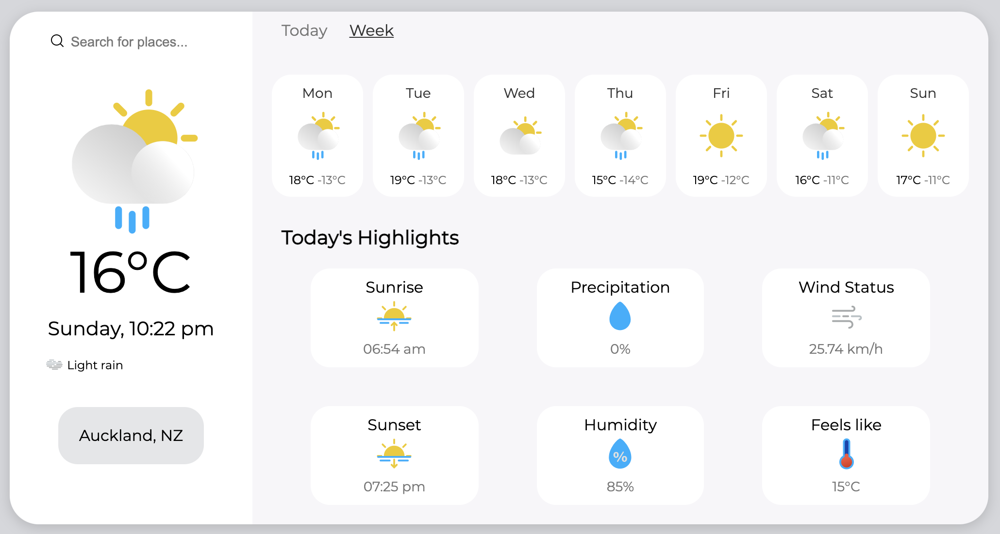

# Weather App

A weather application which renders data based on city input:

- Renders daily or hourly forecast based on what button is clicked.
- Renders different parameters (sunrise, wind status, humidity...)
- Renders different icons based on weather conditions.
- Icons from [Laura Reen](http://laurareen.com/).

### Technologies used

- HTML/CSS
- JavaScript
- OpenWeather API

### Concepts used

- MVC Architecture
- Async/Await API calls
- Responsive Design

### Screenshots

